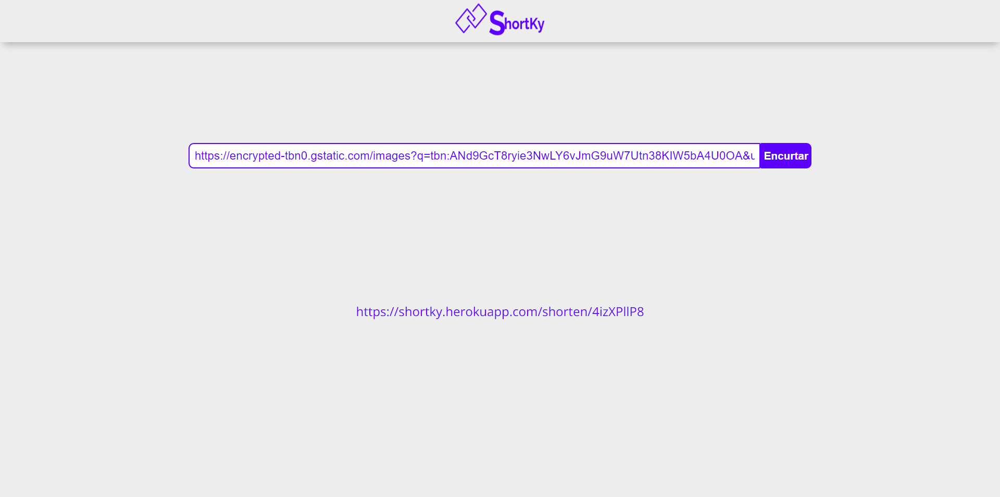

# 📃 SHORTKY

## SEE PREVIEW HERE: https://shortky.netlify.app/

## Docs: https://shortky.herokuapp.com/swagger/

### Server Repo: https://github.com/GiovannaK/shortky-url-shortener
---


<p align="center">
  <a href="#description">Description</a>&nbsp;&nbsp;&nbsp;|&nbsp;&nbsp;&nbsp;
  <a href="#Features">Features</a>&nbsp;&nbsp;&nbsp;|&nbsp;&nbsp;&nbsp;
  <a href="#how-to-use">How to Use</a>&nbsp;&nbsp;&nbsp;|&nbsp;&nbsp;&nbsp;
  <a href="#license">License</a>&nbsp;&nbsp;&nbsp;|&nbsp;&nbsp;&nbsp;
  <a href="#author-info">Author Info</a>
</p>

---

## Description
### ShortKy is a web app to shorten links

## Technologies

### Front-end
- React
- NextJS
- Styled Components

# Features

## PROGRESSIVE WEB APP
- This application has PWA features

### Flux

- You can type any link
- Link will be sent to server
- Short url will be generated and stored on database
- Short url will be sent to client
- Finally you can be redirected using short url

---
## ❗ How To Use

### Run locally

### Clone the project

```html
git clone https://github.com/GiovannaK/shortky-url-shortener-client
```

### Add a .env.local file on root and a key called NEXT_PUBLIC_API_URL, fill information with server address

### Assuming you already have NodeJS and npm installed and properly configured: Run the command below to install all required dependencies

```html
npm install
```
### Finally you can run the project
```html
npm run dev
```

---

## 📌 License

MIT License

Copyright (c) [2020]

Permission is hereby granted, free of charge, to any person obtaining a copy
of this software and associated documentation files (the "Software"), to deal
in the Software without restriction, including without limitation the rights
to use, copy, modify, merge, publish, distribute, sublicense, and/or sell
copies of the Software, and to permit persons to whom the Software is
furnished to do so, subject to the following conditions:

The above copyright notice and this permission notice shall be included in all
copies or substantial portions of the Software.

THE SOFTWARE IS PROVIDED "AS IS", WITHOUT WARRANTY OF ANY KIND, EXPRESS OR
IMPLIED, INCLUDING BUT NOT LIMITED TO THE WARRANTIES OF MERCHANTABILITY,
FITNESS FOR A PARTICULAR PURPOSE AND NONINFRINGEMENT. IN NO EVENT SHALL THE
AUTHORS OR COPYRIGHT HOLDERS BE LIABLE FOR ANY CLAIM, DAMAGES OR OTHER
LIABILITY, WHETHER IN AN ACTION OF CONTRACT, TORT OR OTHERWISE, ARISING FROM,
OUT OF OR IN CONNECTION WITH THE SOFTWARE OR THE USE OR OTHER DEALINGS IN THE
SOFTWARE.

---

## Author Info

- Linkedin - [Giovanna Cunha](https://www.linkedin.com/in/giovanna-kelli/)
